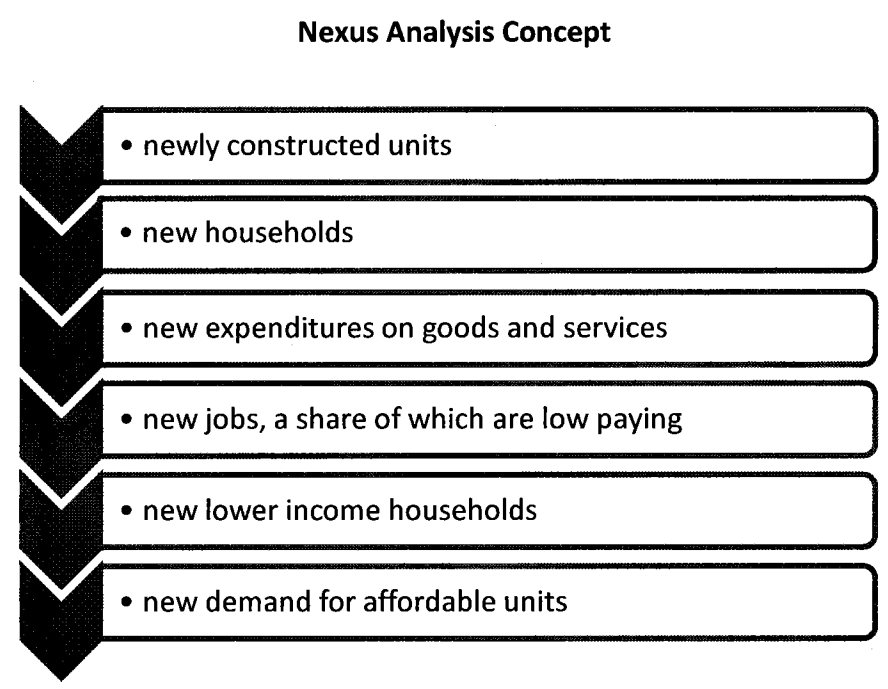

extends: default.liquid

title: Stop Quoting the Residential Nexus Analysis
date: 15 April 2017 17:30:00 -0700
date_formatted: Sat, 15 Apr 2017
yyyy: "2017"
mm: "04"
allow_comments: true
---
Re: Inclusionary Housing Requirements legislation (Peskin and Kim [Board File No. [161351](https://sfgov.legistar.com/LegislationDetail.aspx?ID=2909828&GUID=BB4FBE55-FF04-442F-A446-832E61E18CB8)] vs. Safai, Breed, and Tang [Board File No. [170208](https://sfgov.legistar.com/LegislationDetail.aspx?ID=2974438&GUID=52814392-603F-4C08-8EF6-ADC769CD2325)])

To San Francisco Planning Commissioners and Board of Supervisors:

One study that gets brought up increasingly frequently in San Francisco is the [Residential Nexus Analysis](http://commissions.sfplanning.org/cpcpackets/2016%20%20Residential%20Affordable%20Housing%20Nexus%20Analysis.pdf). To some anti-market rate housing crusaders (such as [Tim Redmond](http://48hills.org/2015/06/14/why-market-rate-housing-makes-the-crisis-worse/) of 48hills.org and [Peter Cohen](http://www.sfexaminer.com/dont-believe-the-hype-affordable-housing-does-not-depend-on-market-rate-development/) of CCHO), the study is a rare authoritative study that proves their belief that market-rate housing is harmful. To others, the study may simply be a guide to fair Inclusionary Zoning set-asides. Unfortunately, due to fatal flaws in the methodology of the Residential Nexus Analysis, it cannot be used for any purpose. To understand why, we’ll have to go into a few details about what the Residential Nexus Analysis is and is not.

## Background: A Useful Fiction

San Francisco requires housing developers to set aside a portion of each project to low-income and moderate-income households (currently temporarily set to 25% for developments of 25 or more units under [Proposition C from June 2016](https://ballotpedia.org/San_Francisco,_California,_Affordable_Housing_Requirements_Charter_Amendment,_Proposition_C_(June_2016))). Optionally, they can instead construct even more off-site units, or pay an Affordable Housing Fee.  If developers elect to pay the Affordable Housing Fee, then the City uses the fee to construct or purchase apartments to rent to low-income households and to provide housing subsidies to moderate-income households ([Planning Code Sec. 415.5](http://library.amlegal.com/nxt/gateway.dll/California/planning/article4developmentimpactfeesandprojectr?f=templates$fn=default.htm$3.0$vid=amlegal:sanfrancisco_ca$anc=JD_415.5)). The [2016 Residential Nexus Analysis](http://commissions.sfplanning.org/cpcpackets/2016%20%20Residential%20Affordable%20Housing%20Nexus%20Analysis.pdf) is a 78-page document by Keyser Marston Associates, Inc. (KMA), that was commissioned by the City of San Francisco in order to satisfy legal requirements for the Affordable Housing Fee. It replaces the [2007 Residential Nexus Analysis](http://sf-planning.org/sites/default/files/FileCenter/Documents/8380-FINAL%20Resid%20Nexus_04-4-07.pdf), and was written by the same firm and uses the same methodology.

A nexus analysis is required for development fees due to the Takings Clause of the Fifth Amendment of the U.S. Constitution, which limits what requirements local governments can impose on people’s use of property without compensation under the government’s police power (to promote health, safety, morals, and general welfare). In 1987, the U.S. Supreme Court decision [*Nollan v. California Coastal Commission*](https://en.wikipedia.org/wiki/Nollan_v._California_Coastal_Commission) overturned a development exaction because the government failed to show an “essential nexus” between the development and the need for the exaction. Subsequently, the State passed the Mitigation Fee Act, which requires local governments to make written findings that there is a “reasonable relationship” between development fees and the need for the fee (1987 AB 1600; [Gov. Code Sec. 66000](https://leginfo.legislature.ca.gov/faces/codes_displayText.xhtml?lawCode=GOV&division=1.&title=7.&part=&chapter=5.&article=)).

A nexus analysis is *not* required when the fee is an option in lieu of a different requirement that is legally imposed. For example, in 2015, the California Supreme Court ruled in [*California Building Industry Association v. City of San Jose*](http://ww2.kqed.org/news/2015/06/15/california-supreme-court-upholds-san-joses-affordable-housing-rules/) that San Jose’s inclusionary housing fee was legal because it was in lieu of a *for-sale* condo price ceiling that does not constitute a taking. Because the condos were for-sale, not for rent, the court determined that San Jose zoning for low-income for sale housing was a legitimate use of police power via zoning. However, *rent* ceilings are *not* allowed because the 1995 Costa-Hawkins State law ([Civ. Code Sec. 1954.50](http://leginfo.legislature.ca.gov/faces/codes_displayText.xhtml?lawCode=CIV&division=3.&title=5.&part=4.&chapter=2.7.&article) et seq.), as interpreted in [*Palmer v. City of Los Angeles*](http://caselaw.findlaw.com/ca-court-of-appeal/1077003.html) in 2009, prohibits any rent ceilings for new units. Therefore, it is current state law that Residential Nexus Analyses are necessary for price controlled rental housing, but not price controlled for sale housing. San Francisco’s own Affordable Housing Fee used to be considered in-lieu of an inclusionary zoning requirement with a sale price ceiling or rent ceiling, but the fee is now considered the primary legal requirement because Costa-Hawkins forbids rent ceilings.

Another exception to the requirement for a nexus analysis is when the deed restricted housing is a voluntary concession in exchange for something of value, such as a subsidy, property tax abatement or an upzoning. Upzoning along with deed-restricted housing requirements is the greatest potential source of affordable housing and also the greatest opportunity for compromise to build more market-rate housing while using the created value to benefit low-income households. New York City and Seattle have both taken leadership in increasing mandatory inclusionary zoning along with upzoning.

A third exception to the requirement for a nexus study is when we impose a tax instead of a fee. But a tax on development is considered a special tax under Proposition 13 [requiring two-thirds of voters](http://www.lao.ca.gov/reports/2014/finance/local-taxes/voter-approval-032014.aspx) to pass, making it fairly difficult to pass and adjust.

In summary, the City commissioned the Residential Nexus Analysis because it is the most convenient legal path to impose the requirement that developers of both for-sale and for-rent housing set aside a portion of their units for low-income households. But the fact that it is a convenient document does not make it accurate. In fact, the Residential Nexus Analysis itself cautions *against* using it to guide policy: “This analysis has not been prepared as a document to guide policy design in the broader context… The findings presented in this report represent the results of an impact analysis only and **are not** policy recommendations for changes to the San Francisco Program” (emphasis in original). In other words, the Residential Nexus Analysis might be good enough to fool a judge, but we should not use it to guide inclusionary housing requirements. And there are even doubts that it will be able to fool a judge; a [report by the law firm Perkins Coie](https://www3.mydocsonline.com/pub/hbancstaff/Perkins%20Coie%20Legal%20Analysis%20of%20Post%20Palmer%20and%20Patterson%20Nexus%20Studies.pdf) questions whether the Residential Nexus Analysis even satisfies the “reasonable relationship” standard required by the courts.

## Step 1: New housing. Step 2: ??? Step 3: Adverse Impact!

The Residential Nexus Analysis uses a seemingly complicated but conceptually fairly simple model of linkages to show a relationship between housing construction and housing need. At first glance, it is easy to be dazzled by the many spreadsheets used to measure income and apportion the economic multipliers. But on closer inspection, the methodology plays fast and loose with assumptions and ignores mitigating factors in its path to finding an adverse impact. So let’s break down its methodology.

 
Figure from the Residential Nexus Analysis

The paper assumes that 100 condos or 100 apartment buildings are built in San Francisco and are sold/rented at prevailing market prices. It assumes that the buyers/renters are new high-income households to the city who spend 62%–65% of their gross income on housing, goods, and services in San Francisco. It then uses the IMPLAN multiplier program to determine how much indirect and induced employment will grow in San Francisco as a result of the economic stimulus to each major occupation of the economy. Then it estimates the fraction of households in each occupation that are low-income and medium-income to estimate impact if housing is provided on-site. Finally, to estimate the equivalent impact fee, it uses affordability gap numbers from MOHCD to convert the on-site percentage to a fee.

### Assumption: One new housing unit causes one new high-income household to migrate

Let’s suppose that the described steps are causal, as certain members of the Planning Commission and Board of Supervisors have done. The most problematic step is the second step, which assumes that each newly constructed housing unit causes a brand new high-income household to move to the city. This is problematic because there are many alternate possibilities.

One possibility is that the household may have moved anyway for a new job regardless of whether there was a new housing unit. In this case, the most immediate result of the housing is protection of a different household from displacement. There would be some income effect, but the relevant household to examine would be the one that was protected from displacement.

Another possibility is that the high-income household may not be a new household to San Francisco, but may instead have moved from a different location in the City (City Economist Ted Egan [found in a 2015 report](http://openbook.sfgov.org/webreports/details3.aspx?id=2199) that 84% of households of new housing are not new to the City). In this case, the household typically leaves a vacancy somewhere else in the city, allowing a different net new household to move or stay in San Francisco who would otherwise not have moved in, or who would otherwise have been displaced. The net new household, who is most sensitive to a minor rent increase or decrease, is likely to have a lower income and create a much smaller economic stimulus than the one purchasing the new condo.

A third possibility is that the net new household to the city came from a different location in San Francisco but left no vacancy behind. There are numerous anecdotal reports of uncomfortably crowded housing (such as [hostels](http://sanfrancisco.cbslocal.com/2015/09/10/san-francisco-hacker-co-living-hostels-bunk-beds-landlords-rentals/), [communes](http://48hills.org/2017/01/24/millennial-commune-issued-violation-notice/), and [split apartments](http://www.sfgate.com/realestate/article/Startup-is-quietly-packing-SF-s-empty-luxury-11039436.php), and other private apartment sharing arrangements) and delayed household formation in San Francisco (such as adults [living with their parents](http://www.nbcbayarea.com/news/local/Theres-No-Place-Like-Home--315-of-San-Francisco-Millennials-Live-With-Their-Parents-416774963.html)), especially among the millennial generation, and some of the net housing growth will result in reduced crowding instead of new migration. In this case, there would be zero economic stimulus from the income effect of the new household, since all members of the new household already lived in the City.

### Assumption: supply and demand don’t exist

Many people who hear about the Residential Nexus Analysis would immediately wonder how it is able to find that constructing housing in famously unaffordable San Francisco is harmful for housing affordability. The trick is quite simple actually: it ignores the economic theory known as supply and demand. This could perhaps be forgiven if the study examined only *direct* impacts of development, but it doesn’t. The impact that it claims is the indirect and multiplied induced net employment growth.

People who study the housing market usually employ a model of supply and demand to estimate changes to the variables of interest such as housing costs when the quantity supplied is increased. Under a typical model of a negatively sloping demand for a good, an increase in supply will tend to reduce the price of the good for everyone who is paying the market price. In the context of housing in San Francisco, this theory would imply that an increase in supply would reduce housing cost burdens for everyone who pays market rent or is in the market to buy or rent housing. For some concrete numbers, the City Economist estimates the price elasticity of demand for renters is −0.72, meaning that an increase in supply of 1% would result in a decrease in market rents of 0.7%. He also estimates that 15% of residents move each year.

The Residential Nexus Analysis gets around all this by assuming that a new development of 100 units does not compete against existing housing but somehow attracts new residents who would not otherwise have looked for existing housing. At the same time, it assumes that the new housing units receive their price from the market. A more reasonable model would make the cost of housing endogenous by considering the new development a part of San Francisco’s housing stock which is desirable by existing residents.

The absence of a reasonable model of the housing market leads the Residential Nexus Analysis to make some counterintuitive and fallacious results. For example, the same methodology can be applied to nonprofit developers too: a nonprofit developer who rents his unit at affordable rates to low-income households creates an economic stimulus that the City could capture if it desired. The study also oddly implies that the best use for a new housing unit is to sell it to a foreign investor to leave the unit vacant, since there would then be no new spending in San Francisco and no economic stimulus (p. 41).

## The nexus relationship is incidental, not causal

I should note that KMA itself does *not* describe the presented sequence as causal. KMA uses bold print to indicate that this calculation is a legal exercise only and “**not policy recommendations**” (p. 33; emphasis in original). And when Perkins Coie asked KMA whether they believed that the construction of market-rate housing *caused* a low- and moderate-income need, KMA would go no further than to respond that it “meet[s] the reasonable relationship standard under the Mitigation Fee Act” (Robinson and Chou, p. 9).

In some places, the Residential Nexus Analysis concedes flaws in its assumptions but proceeds anyway without any adjustment because lack of causation is no barrier to the legal exercise. For example, under the “Net New Underlying Assumption” section, the report briefly concedes that the purchasers may not be new to the city, but it makes no effort to adjust for the different characteristics of the real “net new households” (p. 11). The report also contains a section “Impacts Under Alternative Scenarios to Construction of New Market Rate Unit” which admits that high-income households may move to the city regardless of whether housing is developed for them, but proceeds without any correction under the theory that the impacts are “reasonably related” even if not causally related (p. 42). If KMA were asserting a causal relationship, the impact would have to be adjusted substantially lower due to these false assumptions.

In short, the described relationship between market-rate housing construction and low-income and moderate-income housing need is not a causal one. It is an incidental relationship only.

By this reasonable incidental relationship logic, anyone who interacts in any way with a high-income individual could be held responsible for the entire high income household. Do you serve lemonade to high-income households? A Lemonade Stand–Housing Nexus Analysis could hold you responsible to the tune of tens of thousands of dollars per customer for 100% of the economic stimulus caused by each high-income customer, even though your business had little bearing on their decision to locate in San Francisco! As long as we don’t double-count the high-income households among our various nexus studies, KMA’s nexus methodology would allow the City to charge you for doing any business whatsoever with high-income households.

## Conclusion

The Residential Nexus Analysis is a legal exercise that unjustifiably assumes that each new housing unit is responsible for one new high-income household and all the spending that they do. Since the assumption is incorrect, the study does not support any causal statement of adverse impact from new construction. Given that San Francisco is famous for having [among the most unaffordable housing costs](http://sf.curbed.com/2017/2/22/14700442/san-francisco-rents-highest-world-price) in the country, it is important to recognize that this study provides no evidence for the frequent assertion by some that adding supply does not help.

I do support Inclusionary Zoning or taxes, especially when combined with upzoning. Given that Proposition 13 forbids annual property taxes at current economic value, it is reasonable to tax landowners at the time that they develop the land to exercise the development potential, provided that the tax does not distort the market by rendering badly needed housing infeasible compared to the existing use of the land. Increasing inclusionary housing requirements at the time of an upzoning is also an excellent idea, since the value created would otherwise be a regulatory “giving,” and a portion of this value can be directed toward aid to low-income households. When determining appropriate inclusionary housing requirements, the question should be whether the development remains economically feasible after the requirement and whether the requirement would be a taking; the Residential Nexus Study should have no bearing in the discussion.

I am also receptive to the idea that investments in a neighborhood, including market-rate housing, can contribute to making the neighborhood attractive to new residents and unaffordable to existing residents. The Urban Displacement Project has made a study that [explores this possibility](http://www.urbandisplacement.org/blog/development-and-displacement). This is different from the relationship that the Residential Nexus Analysis studies because the Residential Nexus Analysis proposes a citywide impact with a different proposed mechanism.

The Residential Nexus Analysis itself should never be used to determine policy. Perhaps we could keep it around until such a time that the City is sued by a developer and it is tested in court, but I think it would be more prudent to structure the Inclusionary Housing requirement so as not to depend on the Residential Nexus Analysis either intellectually or legally.

Yonathan Randolph is a resident of the Ingleside of almost four years.