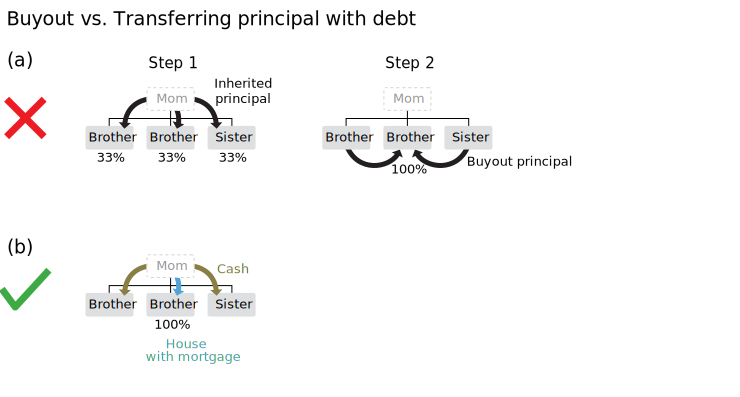
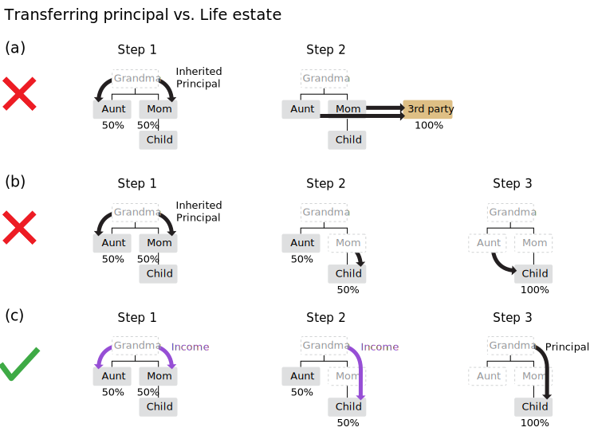

layout: default.liquid

title: How to keep a low Proposition 13 property tax when you transfer property in California
published_date: 2017-10-12 23:00:00 -0700
data:
  is_post: true
  date_formatted: Thu, 12 Oct 2017
  yyyy: "2017"
  mm: "10"
  allow_comments: true
is_draft: false
---

Update (November 16, 2020): Due to Proposition 19 ([ACA 11](https://leginfo.legislature.ca.gov/faces/billTextClient.xhtml?bill_id=201920200ACA11)), some provisions are changing in 2021. See [2020 inheritance update for the inheritance options before Proposition 19 goes into effect](2020-11-proposition-19-parent-child-deadline.html)

Property owners in California know that their property taxes only go up about 2% per year, no matter how valuable the property has become, until the property undergoes a change in ownership or new construction. Many property owners are also aware of the exclusions from change in ownership for transfers between parents and children. But what is less known is that upon death, inexperienced trustees typically divide the property evenly, leaving siblings, aunts/uncles, and cousins to sell the property amongst themselves and undergo a majority change in ownership and large tax increase. But with a little foresight, the owner or trustee can divide the value of the property evenly while ownership of the property goes to one descendant, keeping the assessed value low indefinitely.

If you are a property owner contemplating passing away at some point, or if you are the trustee of an estate, you may consider some of these tricks to keep your family’s taxes low. Note that the principal itself is much greater than the taxes, so the tax considerations probably shouldn’t be enough to incentivize you to make big changes to the beneficiaries of your trust. But it is still worth checking to see whether small changes can save your beneficiaries hundreds of dollars per month.

If you are a policy wonk interested in the effects of Propositions 13, 58, 60, 90, and 193, then read on to learn some of the wondrous ways they can be used to protect inherited wealth. Warning: this post is longer than usual.

## Examples

### Transfer to one child only

If a parent has only one child, then passing the property to the child is easy. When a parent transfers his primary residence to his child, or when he transfers up to a lifetime limit of $1 million of assessed value of other property, the transfer is excluded from change in ownership, and the child pays the same low property taxes as the parent.

2020 update: Proposition 19 adds principal residency requirements; see [Proposition 19 deadline](2020-11-proposition-19-parent-child-deadline.html). After Proposition 19 goes into effect on Feb. 16, 2021, the transferor and transferee must live in the house.

### Transfer equally to multiple children

Things get trickier when there are multiple children. When a parent has multiple children, a typical trust will divide the possessions on a share and share alike basis among all the children, and the trustee then typically gives each child equal ownership of the house (tenants in common). But the children often do not want to co-own the property with each other, so they decide to cash out by selling the property to the sibling who does want to own the property. Since there is no exclusion for sibling-sibling transfers, these sales are changes in ownership that result in the assessed value increasing most of the way to market value. If there are 3 siblings, then two of the siblings selling it to the third will result in a ⅔ change in ownership, and the assessed value goes up ⅔ of the way from the previous assessed value to the current market value.

To put a dollar figure on it, suppose that the home is currently assessed at $200,000 (and property tax of $200,000 × 1.2% = $2,400 per year) but the fair market value is now $1,000,000\. If one sibling buys out the other two, then the new assessment will be $200,000 × ⅓ + $1,000,000 × ⅔ = $733,333, and the new property tax will be $733,333 × 1.2% = $8,800 per year. This is a tax increase from $2,400 per year to $8,800 per year.

On the other hand, if the trustee gets a mortgage on the property *prior to* distributing it, then the trustee can distribute the house with mortgage to one child, then distribute cash of equal value to the other children, so that the child doesn’t have to buy out his siblings. There is only one transfer, the excluded transfer from the parent to the child, so the sibling pays the same taxes as the parent (plus 2% more property tax per year, minus the mortgage interest deduction). This figure shows the distinction between a sibling to sibling transfer and a transfer of a mortgaged house:

<figure>

<figcaption>Figure: Buyout vs. transferring principal with debt. <b>(a)</b> If the trustee simply transfers ownership of the property equally to the three children, then the assessor will record each child’s 33% ownership at 33% of the assessed value (excluded from change in ownership). Then, when one brother buys out the property from the other two siblings to acquire 100% ownership, the assessor will record a 67% change in ownership. <b>(b)</b> If, on the other hand, the trustee mortgages the property before transferring it to the brother and gives the other siblings cash, then the brother receives 100% of the property excluded from change in ownership.
</figcaption>
</figure>

The disadvantage of the trustee getting a mortgage to make a non-pro rata distribution is that it may be difficult for a trustee to get a mortgage on a property. If the original owner thinks ahead, he can have a carefully written trust that avoids the need to get a third-party mortgage (see details below on using a debt to other beneficiaries or option to purchase).

### Transfer to grandchildren

For the most part, grandparents or their trustees should transfer the ownership of their property to a child (using a mortgage or other trick), who can in turn transfer it to a grandchild.

But there are certain cases when it makes sense for the grandparent to write a trust to transfer property to a grandchild. For example, the child in the middle generation may not be responsible enough to transfer the property to the grandchild, or the child may already have used up her $1 million parent-child exclusion on a different grandchild. In such cases, the grandparent can write a trust that uses the property to provide income for the child for her life and then transfers the principal to the grandchild. The life estate of income to children is needed because the parents need to be dead before a grandparent-grandchild transfer is excluded. By using a trust, the grandparent can ensure that the principal as well as the low property tax will be transferred to the grandchild after the parents’ death.

Such a trust that creates a life estate of income followed by a principal transfer can also be used to avoid non-excluded sibling-sibling and aunt-nephew transfers, as shown in the following illustration.

<figure>

<figcaption>Figure: Transferring principal vs. Life estate. <b>(a)</b> If Grandma wills the property to her children, they may sell it and leave out the grandchild. <b>(b)</b> Or, if Grandma wills a property to her two children, Mom wills her 50% to the grandchild, and Aunt also wills her 50% to the grandchild, then the aunt-nephew transfer is a 50% change in ownership. <b>(c)</b> Grandma can make a trust that provides income to the middle generation followed by a transfer of principal to the grandchild. This protects the property from sale, provides income for the middle generation, and ensures that all the transfers can be excluded from change in ownership.</figcaption>
</figure>

If you are a grandchild in the line of succession and the middle generation already has secure housing, then it may be advantageous to have a conversation with your elders about estate planning to minimize your future tax burden.

## Property tax law in California

Now let’s get to the nitty-gritty.

[Article XIII A](https://www.boe.ca.gov/lawguides/property/archive/2010/ccp/art-XIII-A-all.html) of the California Constitution, which was added by Proposition 13 of [June 1978](http://repository.uchastings.edu/ca_ballot_props/846/), limited ad valorem property taxes throughout the state to 1% per year (plus a bit more for voter-approved bonds) of the taxable value (also known as “full cash value,” or assessed value). Unlike every other state, the taxable value is not based on regular appraisals. Under Proposition 13, the “base year value” is the appraised value at the date of acquisition, and the “factored base year value” for a later year is the base year value increased by inflation capped at 2% per year (for the official inflation rate, see the [Consumer Price Index update for 2017-18](http://www.boe.ca.gov/proptaxes/pdf/lta16055.pdf), found in the [Letters to Assessors](http://www.boe.ca.gov/proptaxes/ltacont.htm)). Proposition 8 of [November 1978](http://repository.uchastings.edu/ca_ballot_props/844/) further limits the taxable value to the fair market value to account for declines in value.

<figure>

<figcaption>Figure: assessed value for a hypothetical property that was last purchased in 1987. The base year value is the market value at the date of purchase (which is the purchase price for a normal arms-length transaction). Thereafter, the Proposition 13 factored base year value grows up to 2% per year. When there is a decline in market value, the assessed value is the lesser of the factored base year value and the market value according to Proposition 8.</figcaption>
</figure>

Besides the 2% inflation, the “full cash value” only increases when there is new construction or a “change in ownership.” The assessed value of a property is split into the value of the land and the value of the buildings. Each time there a renovation, the assessor adds the current value of the improvements to the assessed building value but does not increase the assessed land value. When a property is sold, it undergoes a full change in ownership, and the entire assessed value increases to market value. When it is partially transferred, a partial change in ownership occurs, and a fraction of the base year value increases to the fair market value. To calculate partial transfers, the assessor also keeps track of the percentage ownership and base year value for each co-owner ([Letter 85/85](http://www.boe.ca.gov/proptaxes/pdf/85_85.pdf)). In summary, in order to calculate the new total base year value after new construction and changes in ownership, the assessor tracks the percentage ownership of each owner, the factored base year value of the land for that co-owner, and the factored base year value of the improvements for that co-owner.

Proposition 58 of [November 1986](http://repository.uchastings.edu/ca_ballot_props/971/) further amended Article XIII A to exclude from “change in ownership” unlimited spouse transfers and limited parent↔child transfers (any principal residence, and the first $1 million of other property). Proposition 60, also in [November 1986](http://repository.uchastings.edu/ca_ballot_props/971/), allowed a transfer of a house’s base-year value when a person (over 55 years old or disabled)  purchases a replacement dwelling of equal or lesser value. Proposition 193 of [March 1996](http://repository.uchastings.edu/ca_ballot_props/1140/) allowed grandparent→grandchild transfers with the parents are dead. As a result of these propositions, property taxes in California are extremely favorable to long-time property owners and their descendants. The property tax discount follows the property as it passes from one generation to the next, and the discount can also follow a person as he moves from one house to another.

The change in ownership language of [Article XIII A §2](https://www.boe.ca.gov/lawguides/property/archive/2010/ccp/XIII-A-2.html) in the California Constitution is implemented in statute by [Revenue and Taxation Code (RTC) §60 onwards](https://www.boe.ca.gov/lawguides/property/archive/2010/rt/part05-ch2-all.html), and the [Board of Equalization regulations](http://www.boe.ca.gov/lawguides/property/archive/2010/rule/rule-ch1.html), The Board of Equalization also publishes [Property Tax Annotations](https://www.boe.ca.gov/lawguides/property/current/ptlg/annt/property-tax-annotations.html), which are collections of [Letters to Assessors](http://www.boe.ca.gov/proptaxes/ltacont.htm) to answer specific questions of interpretation but are not binding on assessors or courts. All the information here comes from one of those areas of the Board of Equalization website.

The overarching definition of change in ownership in [RTC §60](https://www.boe.ca.gov/lawguides/property/current/ptlg/rt/part05-ch2-all.html) still matches the recommendation from the 1979 [Report of the Task Force on Property Tax Administration](http://digitalcommons.law.ggu.edu/cgi/viewcontent.cgi?article=1470&context=caldocs_assembly), which was convened after Proposition 13 and 8 passed: “A ‘change in ownership’ means a transfer of a present interest in real property, including the beneficial use thereof, the value of which is substantially equal to the value of the fee interest.” This is the general rule which is followed for any situation not covered by sections 61 and 62\. Under the specific rules, a change in ownership does not include giving renters a short lease (under 35 years), getting a loan and deed of trust, and putting the title of the property in a *revocable* trust. A change in ownership *does* include selling the property, creating or terminating a long lease (over 35 years), and creating or terminating a life estate of income or tenancy ([Annotation 220.0780](https://www.boe.ca.gov/lawguides/property/current/ptlg/annt/220-0780.html), [*Leckie v. County of Orange* (1998) 65 Cal.App.4th 334](http://caselaw.findlaw.com/ca-court-of-appeal/1462014.html)), unless the beneficiary is the transferor himself or a spouse/parent/child/grandchild who qualifies for an exclusion.

When a trustor creates a trust, the assessor ignores the trustee (who holds legal title) and reads the trust to see who has beneficial use of the property. For a property held by a revocable trust that becomes irrevocable on death, the date of death is a change in ownership, a change in the beneficiary is a change in ownership, and the transfer of property out of the trust is a change in ownership, unless the new beneficiary is a spouse/parent/child/grandchild who qualifies for an exclusion ([Rule 462.160](http://www.boe.ca.gov/lawguides/property/current/ptlg/rule/462-160.html)). For both the creation of the life estate and the transfer to the remainderman (the beneficiary of the remainder after the life estate terminates), *the creator of the trust is the transferor*. Change in ownership can be avoided if the trust creates life estates and principal distributions to excluded beneficiaries.

## Tricks

Here are various techniques that can be used to pass on your Proposition 13 factored base year value from one generation to the next.

*   Unlimited **spouse transfers** ([RTC §63](https://www.boe.ca.gov/lawguides/property/archive/2010/rt/part05-ch2-all.html#63), [Constitution Article XIII A §2](https://www.boe.ca.gov/lawguides/property/archive/2010/ccp/XIII-A-2.html)(g), Rule 462.220): Transfers of community and non-community property between spouses are totally excluded from change in ownership. This rule has been included ever since the original Proposition 13 [Task Force Report](http://digitalcommons.law.ggu.edu/cgi/viewcontent.cgi?article=1470&context=caldocs_assembly) recommended it and later become part of the constitution (Proposition 58 of [November 1986](http://repository.uchastings.edu/ca_ballot_props/971/)).
*   **Parent↔child transfers** (Proposition 58 of [November 1986](http://repository.uchastings.edu/ca_ballot_props/971/), [Constitution Article XIII A §2](https://www.boe.ca.gov/lawguides/property/archive/2010/ccp/XIII-A-2.html)(h), [RTC §63.1](https://www.boe.ca.gov/lawguides/property/archive/2010/rt/63-1.html)): Each parent can transfer their principal residence, as well as a total lifetime limit of $1 million of factored base year value, to a child. Note that the limit for other property is $1 million of assessed value, not fair-market value, which is very advantageous. Children can also transfer properties to their parents under the same rule.

    2020 update: Proposition 19 adds principal residency requirements; see [Proposition 19 deadline](2020-11-proposition-19-parent-child-deadline.html). After Proposition 19 goes into effect on Feb. 16, 2021, the transferor and transferee must live in the house

*   **Grandparent→grandchild transfer** when parents are deceased (Proposition 193 of [March 1996](http://repository.uchastings.edu/ca_ballot_props/1140/), [Constitution Article XIII A §2](https://www.boe.ca.gov/lawguides/property/archive/2010/ccp/XIII-A-2.html)(h), [RTC §63.1](https://www.boe.ca.gov/lawguides/property/archive/2010/rt/part05-ch2-all.html#63-1)): Grandparents can transfer their principal residence and up to $1 million of other property to grandchildren (the lifetime limit includes any parent-child transfers they did). Grandparent→grandchild transfers are more limited than parent↔child transfers, because the transferee (grandchild) is also limited to *receiving* only one principal residence from any parent, child, or grandparent. And for transfers that don’t qualify as a principal residence transfer, the values of properties transferred from the transferor (grandparent) and received by the transferee (grandchild) (from *any* parent or grandparent) are combined to calculate the $1 million limit. The parents (child of the grandchild, as well as the other parent if that child-in-law never divorced or remarried) must already be deceased as of the date of the transfer.

    2020 update: Proposition 19 adds principal residency requirements; see [Proposition 19 deadline](2020-11-proposition-19-parent-child-deadline.html). After Proposition 19 goes into effect on Feb. 16, 2021, the transferor and transferee must live in the house

*   **Replacement dwelling** (Proposition 60 of [November 1986](http://repository.uchastings.edu/ca_ballot_props/971/) and Proposition 90 of [November 1988](http://repository.uchastings.edu/ca_ballot_props/988/), [Constitution Article XIII A §2](https://www.boe.ca.gov/lawguides/property/archive/2010/ccp/XIII-A-2.html)(a), [RTC §69.5](https://www.boe.ca.gov/lawguides/property/archive/2010/rt/69-5.html)) An owner over 55 is entitled once in their lifetime to sell their principal place of residence, purchase an equivalently valued replacement dwelling in the same county within two years, and transfer the factored base year value from their original house to the replacement dwelling. (A [few counties](http://www.boe.ca.gov/proptaxes/faqs/propositions60_90.htm#transfers) also allow replacement dwelling claims where the original property was in a different county (Proposition 90)). This is an all-or-nothing transfer; if you fail to sell 100% of the home or to purchase a replacement dwelling under the original dwelling’s sale price within two years, then the transfer of base year value will be rejected; unlike partial changes in ownership, there is no partial replacement dwelling transfer. A very special feature of the factored base year value transfer is that the claimant can be a co-owner of the original property, and he can be a co-owner of the replacement dwelling, with different ownership interests, yet the entire assessed value is transferred ([Annotation 200.0050](https://www.boe.ca.gov/lawguides/property/current/ptlg/annt/200-0050.html))! He doesn’t even have to be the majority owner! Note that when there are multiple co-owners, only one of them has to use up his once in a lifetime transfer, except that if the spouse has partial ownership of the replacement dwelling, then both of them use up their transfer.

    2020 update: Proposition 19 expands the replacement dwelling rules; starting in 2021 you can buy a house in any county for any price.

*   **Non-pro rata distributions of multiple assets**: If a will or trust allocates shares to beneficiaries (e.g., “share and share alike basis”) and allows both pro rata (i.e., each asset is divided in equal shares) and non-pro rata distribution of assets (i.e., some assets can go to one beneficiary and other assets to another beneficiary as long as the value is the same), then the executor/trustee can use a non-pro rata distribution to avoid reassessment to market value. By default, wills only allow pro rata distributions, but trusts do allow either pro rata or non-pro rata distributions ([Probation Code §12646](https://leginfo.legislature.ca.gov/faces/codes_displaySection.xhtml?lawCode=PROB&sectionNum=16246.), [Annotation 220.0885](http://www.boe.ca.gov/lawguides/property/current/ptlg/annt/220-0885.html)). For example, the executor can give one property to one child and another property to another child plus more personal property to equalize the distribution ([Annotation 625.0201](http://www.boe.ca.gov/lawguides/property/current/ptlg/annt/625-0201.html)).
*   **Non-pro rata distribution using loan**: Like above, if a will or trust allows non-pro rata distribution of assets, the executor/trustee can get a loan prior to distributing the property. Trustees have the power to make non-pro rata distributions ([Probate Code §16246](https://leginfo.legislature.ca.gov/faces/codes_displaySection.xhtml?lawCode=PROB&sectionNum=16246.)) and to get a loan ([Probate Code §16228](https://leginfo.legislature.ca.gov/faces/codes_displaySection.xhtml?lawCode=PROB&sectionNum=16228.)) by default. Then, he can distribute the house with mortgage to one spouse/child/grandchild and cash to the other beneficiaries. Then, according to BOE’s guidance to assessors, 100% of the transfer is excluded from change in ownership as long as the value of the property minus the balance on the mortgage does not exceed that beneficiary’s share of the estate ([LTA 91/08](http://www.boe.ca.gov/proptaxes/pdf/91_08.pdf), [Annotations 625.0235.005](http://www.boe.ca.gov/lawguides/property/current/ptlg/annt/625-0235-005.html), [625.0201](http://www.boe.ca.gov/lawguides/property/current/ptlg/annt/625-0201.html)). The loan can come from a third party (though I have read that it can be difficult to find a willing lender to a deceased person’s estate) or from one of the other beneficiaries, but it cannot come from the spouse/child/grandchild receiving the property, since when the transferee is both the lender and the debtor, the assessor will combine these steps into a single non-excluded purchase from the other beneficiaries.
*   **Property encumbered with debt to other beneficiaries**: This is another method to give one excluded spouse/child/grandchild a property and give other beneficiaries cash in a will or trust while avoiding a change in ownership. It is like the method above where a trustee gets a loan prior to making a non-pro rata distribution, except that the trustee does not need to find a lender with enough cash to lend, and the other beneficiaries don’t get a single lump sum payment. The trust can give the spouse/child/grandchild the property along with a debt to pay to the other beneficiaries (either with a deed of trust (mortgage) or without (equitable charge)) ([Annotation 625.0250](http://www.boe.ca.gov/lawguides/property/current/ptlg/annt/625-0250.html)). Unlike getting a mortgage prior to distribution, the promissory note to pay the others would *not* be subtracted from the net value of the property for a share and share alike trust, so this would be a non-excluded buyout of the other beneficiaries’ shares of a standard share and share alike trust ([Annotation 625.0235](http://www.boe.ca.gov/lawguides/property/current/ptlg/annt/625-0235.html)). So unlike a non-pro rata distribution, to avoid change in ownership, this technique requires the trust document to be explicitly worded in order for the assessor to consider the trustor (rather than the other beneficiaries) to be the transferor.
*   **Option to purchase the property**: This is another variation on giving the property to one excluded spouse/child/grandchild and giving cash to the other beneficiaries in a will or trust while avoiding a change in ownership. The trust can give an excluded spouse/child/grandchild the option to purchase the property from the trust before the principal is distributed ([Annotations 625.0233](http://www.boe.ca.gov/lawguides/property/current/ptlg/annt/625-0233.html), [625.0235.025](http://www.boe.ca.gov/lawguides/property/current/ptlg/annt/625-0235-025.html)). As I understand the distinction, the trust can’t give the other beneficiaries the ability to veto the purchase; this would make it a non-excluded sibling-to-sibling transfer ([Annotations 625.0235.010](http://www.boe.ca.gov/lawguides/property/current/ptlg/annt/625-0235-010.html), [625.0260](http://www.boe.ca.gov/lawguides/property/current/ptlg/annt/625-0260.html), [625.0216](http://www.boe.ca.gov/lawguides/property/current/ptlg/annt/625-0216.html)). Unlike non-pro rata distributions, this technique requires the trust document to be explicitly worded.
*   **Excluded transfers of trust remainders** long after death: A superpower that trusts have that you can’t do with just a will is the ability to transfer the beneficial ownership (income or life tenancy), multiple times, to excluded beneficiaries (spouse/parent/child/grandchild) long after the trustor’s death, and the *trustor is the transferor* *of the transfers of trust remainders*. For example, a trust can provide a life estate for one child, then upon death of the child the principal goes to the other child. If the one child himself transferred the property to his sibling, this result in the entire property being reassessed to market value (since sibling-sibling transfers are not excluded from change in ownership). But if the *parent* specifies in the trust that one child receives a life estate and the other child receives the remainder of the property, then *both* transfers are considered to be from the *parent* to the child and are excluded from change in ownership ([Annotations 220.0786](http://www.boe.ca.gov/lawguides/property/current/ptlg/annt/220-0786.html)=[625.0218](http://www.boe.ca.gov/lawguides/property/current/ptlg/annt/625-0218.html), [625.0121](http://www.boe.ca.gov/lawguides/property/current/ptlg/annt/625-0121.html)). Note that other than the initial transfer at death of the transferor’s principal residence, each partial transfer would contribute to the transferor’s $1 million exclusion.

    2020 update: Proposition 19 adds principal residency requirements; see [Proposition 19 deadline](2020-11-proposition-19-parent-child-deadline.html). After Proposition 19 goes into effect on Feb. 16, 2021, each transferee must live in the house, and it’s unclear whether transfers after death can be excluded because the transferor was not occupying the house immediately beforehand.

Transferors can mix and match these tricks as needed. For example:

*   Multiple parent-child **transfers of principal residence**: There is a $1 million limit, per parent, of the total factored base year value of transfers to children of non-principal residences without change in ownership. But there is *no* limit on the number of times a parent can transfer his *principal* residence to a child! If a parent owns multiple houses that he wants to transfer, he can move in to each one for a few years, establish the principal residence homeowner exemption, and then transfer the house to a child. He’ll have to decide whether to sell it for fair market value to his child or to give it and forego the step-up in basis for income tax purposes, but it’s an option to protect the assessed value for property tax purposes. Also, be careful to avoid the step-transaction doctrine (see below). This trick might also be used by grandparents doing grandparent--grandchild transfers but only if they outlive the parents and are transferring to multiple transferees.
*   **Choose a replacement dwelling for your child or grandchild** : A prudent parent might choose a replacement dwelling that would also be suitable to eventually transfer to their child. Be careful to avoid the step-transaction doctrine (see below).
*   **Grandparent→grandchild transfer after life income to children**: If a grandparent wishes to give a property to a grandchild and the parent is still alive, usually it is easiest to transfer it to the child, who can eventually transfer it to the grandchild. But if the child is uncooperative or irresponsible, the grandparent can still transfer a property to the  grandchild eventually. He can write a trust that grants a life estate of rental income to the children (or, alternately, a life estate of tenancy), with shares redistributed among all the children or grandchildren whose parents are deceased, with the principal transferred to the last living beneficiary ([Annotation 220.0786](http://www.boe.ca.gov/lawguides/property/current/ptlg/annt/220-0786.html)=[625.0218](http://www.boe.ca.gov/lawguides/property/current/ptlg/annt/625-0218.html)).

    2020 update: Proposition 19 adds principal residency requirements; see [Proposition 19 deadline](2020-11-proposition-19-parent-child-deadline.html). After Proposition 19 goes into effect on Feb. 16, 2021, each transferee must live in the house, and it’s unclear whether transfers after death can be excluded because the transferor was not occupying the house immediately beforehand.

*   **Grandparent→grandchild option to purchase after parents die**: If a grandparent wants to distribute the principal to a number of grandchildren eventually, he can create a trust that grants a life estate to the parents, followed by giving an option to a grandchild to purchase if the grandchild still survives, with the proceeds distributed among the still surviving grandchildren.

    2020 update: Proposition 19 adds principal residency requirements; see [Proposition 19 deadline](2020-11-proposition-19-parent-child-deadline.html). After Proposition 19 goes into effect on Feb. 16, 2021, each transferee must live in the house, and it’s unclear whether transfers after death can be excluded because the transferor was not occupying the house immediately beforehand.

*   **Replacement dwelling to remove co-owners**: If a person over 55 years old owns his home along with some non-excluded co-owners and he wishes to buy out the other co-owners (but can’t use a Proposition 58/193 excluded transfer), he can’t keep the property without expensive reassessments, but he *can* preserve the assessment applied to a new house. First, they must sell the house. Then, he can purchase a new house of equal or lesser value by himself and file to transfer the factored base year value to the replacement dwelling. (They can actually use multiple transactions to sell their shares, as long as all transactions happen within 2 years of each other.) In this way, he can keep the entire base year value on a new house of almost equal market value.
*   **Replacement dwelling to transfer home assessment**: If a person over 55 years old wishes to transfer his home assessment to a non-excluded transferee, he can’t transfer the house itself with any exclusion under Proposition 58/193, but he *can* transfer the *assessment* on a *new* house to the transferee. First, he sells the house. Then, he purchases a replacement dwelling with the other person as majority co-owner. He files the claim to transfer the factored base year value to the replacement dwelling, and then he later sells or wills the rest of the property to the co-owner. Only the fraction of the replacement dwelling that he owns needs to be reassessed. Be careful to avoid the step-transaction doctrine (see below).

## Warnings

*   **Beware the step-transaction doctrine**: The United States Supreme Court has ruled that the government may use the combined substance rather than the form of a series of transactions to determine the taxes owed. Specifically, if the first step created a “binding commitment” to complete all the steps, or if the steps are “interdependent” to achieve any purpose, or if the “end result” appears to be intended from the outset, then the government may combine the steps to determine how much of the property underwent a change in ownership ([Annotations 220.0666](http://www.boe.ca.gov/lawguides/property/current/ptlg/annt/220-0666.html), [220.0670](http://www.boe.ca.gov/lawguides/property/current/ptlg/annt/220-0670.html)). For example, if a grandparent transfers a property to a parent, on the condition that the parent to transfer it to a child, then the assessor may reassess the property to market value because the grandparent and parent made a binding commitment to make a non-excluded grandparent-grandchild transfer. Or, if a child transferred a property to a parent, only for the parent to transfer it to a different child, then the assessor may reasses the property to market value because it appears that the sibling intended to make a non-excluded sibling to sibling transfer.
*   **Avoid share and share alike with pro rata distribution**: If a will/trust distributes assets on a “share and share alike” basis and requires a pro rata distribution (which is the default for wills but not trusts) to children, then each beneficiary will own equal fractions of each property, and if only one of them wants a property then they will have to make transfers to each other that are not excluded from reassessment to market value ([Annotations 220.0885](http://www.boe.ca.gov/lawguides/property/current/ptlg/annt/220-0885.html), [220.0767](http://www.boe.ca.gov/lawguides/property/current/ptlg/annt/220-0767.html)).
*   **A trust with sprinkle power should name only excluded beneficiaries**: Be especially careful who the beneficiaries of a trust are when you give the trustee sprinkle or spray power. If a trust gives the trustee total discretion to distribute a property, then if *any* of the beneficiaries are non-excluded, then *all* of the property is reassessed to market value ([Rule 462.160](http://www.boe.ca.gov/lawguides/property/archive/2010/rule/462-160.html), [Annotations 220.0821](http://www.boe.ca.gov/lawguides/property/current/ptlg/annt/220-0821.html), [493.0140](http://www.boe.ca.gov/proptaxes/pdf/493_0140.pdf)). For example, avoid writing a trust with sprinkle power whose beneficiaries are “our descendants,” who may include non-excluded grandchildren and great-grandchildren ([Annotation 220.0821](http://www.boe.ca.gov/lawguides/property/current/ptlg/annt/220-0821.html)). If you have a property that you would like to distribute to Proposition 58/193 excluded beneficiary as well as a non-excluded beneficiary (such as a girlfriend, nephew, or grandchild), then consider using one of the tricks above to distribute cash to the non-excluded beneficiary and the property itself to the excluded beneficiary.
*   **Don’t be too creative**. Much of this information has not been tested in court and is subject to interpretation by county assessors. Try to stick to the examples in the annotations. Call your assessor’s office and the state [Taxpayers’ Rights Advocate](https://www.ftb.ca.gov/aboutFTB/Taxpayer_Advocate/index.shtml) for more information.

## Conclusion

This blog post shared some of the tricks that can be used to keep property taxes low in California. There are even more tricks that I did not detail here that wealthy people can use. For example, [Michael Dell’s “too good to be true” beachfront hotel purchase](http://articles.latimes.com/2013/may/05/local/la-me-dell-property-20130505) was not a change in ownership because the property was held in a LLC of which nobody owned a majority (he owned 42.5% and his wife owned 49%) ([*Ocean Avenue LLC v. County of Los Angeles*](http://appellatecases.courtinfo.ca.gov/search/case/mainCaseScreen.cfm?dist=2&doc_id=2036611&doc_no=B246499)[ (2014) 227 Cal.App.4th 344](http://appellatecases.courtinfo.ca.gov/search/case/mainCaseScreen.cfm?dist=2&doc_id=2036611&doc_no=B246499)). Malcolm Gladwell also has an entertaining [Revisionist History podcast on exclusive golf equity clubs](http://revisionisthistory.com/episodes/11-a-good-walk-spoiled), which do not ever undergo changes in ownership because members technically purchase an expensive “license to use” instead of an ownership interest, along with minority voting rights that are akin to shareholders of a corporation ([Annotation 220.0439](http://www.boe.ca.gov/lawguides/property/current/ptlg/annt/220-0439.html)). Proposition 13 protects property investors of all shapes and sizes.

Proposition 13 is one of California’s biggest entitlement programs. When assessment practices were modernized in the 1960s and 1970s, some states created circuit breakers to protect low-income and elderly homeowners, some states classified residential property at a lower tax rate than commercial ([Isaac William Martin, *The Permanent Tax Revolt*](https://www.amazon.com/Permanent-Tax-Revolt-Property-Transformed/dp/0804758719)), and California ended up with a highly regressive acquisition value-based tax system with exceptions so big that a multimillionaire’s entire estate can fit in its change in ownership exclusions. Could you imagine if Social Security’s greatest individual recipients were corporations and old estates, the benefits could be passed down from generation to generation, and for new households it was only available to the upper-middle class? That’s the entitlement program we have created in California. It’s more pyramid scheme than safety net.

For house-rich residents who have witnessed extraordinary appreciation on your home, by all means, use every exclusion available to you to pass your low assessment as well as your property to your heirs. But I hope you also can also understand that California really should have a better-designed safety net that supports all residents in need, not only property owners and children of property owners.

Disclaimer: this is information, not legal advice. Talk to your lawyer to see if tax avoidance is right for you.

