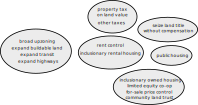

layout: default.liquid

title: Proposition 10 in depth (Costa-Hawkins repeal and rent control expansion)
published_date: 2018-09-21 12:00:00 -0700
data:
  is_post: true
  date_formatted: Fri, 21 Sept 2018
  yyyy: "2018"
  mm: "09"
  allow_comments: true
is_draft: false
---

This blog post discusses some of the pros and cons of [Proposition 10](https://www.oag.ca.gov/system/files/initiatives/pdfs/17-0041%20%28Affordable%20Housing%29_0.pdf) of November 2018, the California voter initiative that would expand cities’ authority to create rent control ordinances and charter amendments. The core of the bill is only a couple sentences long so I’ll reproduce it here:

>**Section 4. Affordable Housing Act shall be codified by repealing the following sections of the Civil Code:** 
>
>Sections 1954.50, 1954.51, 1954.52 and 1954.53 of [Chapter 2.7 of Title 5 of Part 4 of Division 3 of the Civil Code](https://leginfo.legislature.ca.gov/faces/codes_displayText.xhtml?lawCode=CIV&division=3.&title=5.&part=4.&chapter=2.7.&article=) are repealed.
>
>**Section 5. Affordable Housing Act shall be further codified by adding the following section to the Civil Code:**
>
>Section 1954.54. (a) A city, county, or city and county shall have the authority to adopt a local charter provision, ordinance or regulation that governs a landlord’s right to establish and increase rental rates on a dwelling or housing unit. (b) In accordance with California law, a landlord’s right to a fair rate of return on a property shall not be abridged by a city, county, or city and county.
>
The initiative would repeal the Costa-Hawkins Rental Housing Act ([Civil Code §1954.50](https://leginfo.legislature.ca.gov/faces/codes_displayText.xhtml?lawCode=CIV&division=3.&title=5.&part=4.&chapter=2.7.&article=)) and replace it with a rent control enabling act. This blog post will describe the tradeoffs in Proposition 10 in some detail.

## A taxonomy of systems to limit unearned rent

When a region becomes more prosperous yet the housing stock does not grow in proportion, current private landowners collect higher and higher rents from the increasing demand, leaving less income for each household who doesn’t own land. There are a number of ways to address the problem of increasing per-household land costs, each with its own tradeoffs.

First I should mention how the rent is set in the first place. In microeconomics, the market rent is the price at which the same number of units are supplied by landlords as the number of households who are still willing and able to rent. The rent goes up when more people want to live in the region but we prohibit new houses from being built for them. The long-term solution to prevent runaway housing costs while also providing opportunities for new households is to allow and encourage the supply of housing to increase, causing the market price of housing to decrease. This is what America did after World War II: build transportation networks and open up a huge amount of new land around every metro area so that middle class households could afford a home. By all estimates, California’s major metro areas have far underproduced housing for decades since the 1970s ([LAO (2015): California’s High Housing Costs: Causes and Consequences](https://lao.ca.gov/reports/2015/finance/housing-costs/housing-costs.aspx)).

The next cluster is taxation. Progressive taxation is the tried-and-true way to prevent concentrations of wealth into the hands of the few. Property taxes in particular (particularly on value of the land as opposed to the building) are the ideal way to capture the increased land value for public purposes. Because a land value tax does not punish the construction of new housing, it is compatible with increasing housing supply (including through public housing) and economic growth. Unfortunately, the land tax rate is set very low in California due to Proposition 13 of 1978 (the effective tax rate is below 1%). In addition, federal capital gains taxes and inheritance taxes have gone down too, enabling greater concentrations of land wealth.

One idea that occasionally pops up is seizing land title or land reform ([Peter Moskowitz, “Evict the rich”](https://theoutline.com/post/2153/evict-the-rich?zd=1&zi=ussmnruw)). This is not an option in America because the Fifth Amendment prohibits physical “takings” without just compensation. Whenever someone suggests taking land title from landlords as a solution to inequality, they have to be redirected toward taxing land value instead. As the labor activist Henry George pointed out, taxing is just as effective as taking: “We may safely leave them the shell, if we take the kernel. It is not necessary to confiscate land—only to confiscate rent” ([Henry George (1879), *Progress and Poverty*, Chapter 32](http://www.henrygeorge.org/pchp32.htm)).

Public housing should also be mentioned as an underutilized approach to avoid private landlords entirely. Since it is constrained by state and local budgets, public housing would be complementary to raising revenue through land taxes.

Next we have legal caps on contract rent. Rent control and inclusionary rental housing prevent the owner from collecting higher rent from the tenant. The benefits of the increased land value go to the tenant in the form of allowing him to remain as the area becomes more prosperous. Note that inclusionary housing is implemented using a recorded deed restriction when the building is built, so it compels the landlord to participate in the program. On the other hand, rent control usually still allows the landlord to occupy the house himself or sell at market rate, so it is usually less effective at holding down landlord gains (see the owner-occupier section below). In addition, rent controls tend to disincentivize new supply, exacerbating the underlying problem (see next section).

The last cluster contains modified ownership schemes that take away the right to profit on sale. Inclusionary owned housing and limited equity co-ops are deed restrictions that allow the owner to occupy the unit (and benefit from the booming economy) but prohibit the owner from selling the house above a specified price. A city could also impose price controls on the price of all for-sale houses, but I haven’t heard of one that does this.

None of these approaches is a silver bullet to help all segments of the population for all timeframes, so they should be used to complement each other in addressing our housing shortage. Rent control can be a useful part, particularly in the short term as production ramps up, but it’s important to keep in mind its limitations and when it is more appropriate to utilize other approaches to the problem of rising rents.

## Econ 1 and the rationale for Costa-Hawkins

There are many different ways that rents can be regulated. The most well-known form is the hard price control, such as the federal rent control during World War II (from about 1943 to 1947) that fixed the per-unit rental rates on all houses, including new construction, even when tenants moved out and were replaced.

Long-term hard rent control is literally the textbook example of a populist regulation whose unintended consequences end up hurting the very population they are supposed to help. Virtually any economics textbook will have a page on the effects of strong rent control (page from [Gregory Mankiw, *Principles of Economics*](https://books.google.com/books?id=xoztFMavGCcC&lpg=PA115&dq=principles%20of%20economics%20rent%20control%20mankiw&pg=PA115#v=onepage&q&f=false). See also [R. Preston McAfee, *Introduction to Economic Analysis*](https://introecon.com/), or [OpenStax, *Principles of Microeconomics*](https://cnx.org/contents/g7yTQfC4@11/Price-Ceilings-and-Price-Floors), or [Tyler Cowen and Alex Tabarrok, *Modern Principles of Economics*](https://books.google.com/books?id=BdnxxpsF2pMC&lpg=PP1&dq=principles%20of%20economics&pg=PA106#v=onepage&q&f=false)). The unintended consequences of a strong price control include severe shortages and an increasingly dilapidated housing stock. In this context, a shortage means that the rental price is officially affordable, but it is almost impossible for people who need to move to actually find a housing unit unless they have personal connections with other landlords or master tenants. That old-fashioned rent control is very damaging is universally accepted by economists ([Milton Friedman and George J. Stigler (1946), *Roofs or Ceilings?*](https://fee.org/resources/roofs-or-ceilings-the-current-housing-problem/); [Krugman (2000) “Reckonings; A Rent Affair”](https://www.nytimes.com/2000/06/07/opinion/reckonings-a-rent-affair.html)). The mechanisms by which strong rent control can lead to reduced availability of housing are discouraging new construction, discouraging renting (and encouraging conversion to owner-occupancy or other uses), encouraging tenants who already have a large housing unit to remain even when they would prefer to downsize, and in extreme cases landlord abandonment if the rent doesn’t even cover the cost of maintenance.

Here’s where Costa-Hawkins comes in. The Costa-Hawkins state law (1995 [AB 1164](http://www.leginfo.ca.gov/pub/95-96/bill/asm/ab_1151-1200/ab_1164_bill_950804_chaptered.html), [Civil Code §1954.50](https://leginfo.legislature.ca.gov/faces/codes_displayText.xhtml?lawCode=CIV&division=3.&title=5.&part=4.&chapter=2.7.&article=)) incorporates some of the feedback from the economists in order to balance the interests of present renters, present landlords, future renters, and future landlords. Its two key provisions are vacancy decontrol and the exemption of new construction. It also prohibits rent control on single-family homes and condos, which are the easiest to take out of the rental market through conversion to owner-occupancy. Large cities like San Francisco and Los Angeles already had similar provisions; the biggest effect of Costa-Hawkins was on cities such as Santa Monica and Berkeley that had vacancy controls since 1979–1980.

Modern rent control under Costa-Hawkins alleviates several of the economic arguments against the old “hard” rent controls. Local governments are free to protect existing tenants in older housing units by controlling the rent for as long as the tenant lives in the unit. But vacancy decontrol means that once a unit is vacant, the landlord can charge the market-clearing price so that existing landlords can eventually profit from market conditions, and future tenants will be able to find apartments at the market price. The prospect of future profit provides some incentive for the landlord to stay in business instead of converting the unit to for-sale housing or other uses. And the exemption of new construction built after 1995 ensures that rent control does not discourage new construction, so that future investments in apartments will be able to serve future tenants. Finally, the exemption for single-family homes and condos protects undiversified owners of a single housing unit to put their unit for rent. In short, Costa-Hawkins-style rent control is one way to balance both affordability for existing tenants and availability for future tenants.

But there are a number of issues with Costa-Hawkins. Of course, since it is a tradeoff, there are some who benefit and some who lose. Vacancy decontrol means that new tenants don’t get the subsidy that older tenants enjoy. The exemption for new construction, single-family houses, and condos prohibits expanding rent control to the majority of housing units in most cities, and prohibits cities from adopting a single rent control rule that would apply to all units. And the cutoff date (1978 in Los Angeles, 1979 in San Francisco, 1980 in Berkeley, etc., and 1995 for any new rent control) allows unlimited rent increases on “newly constructed” apartments whose mortgage has long since been paid off.

The proposed Proposition 10 would eliminate Costa-Hawkins completely. Local governments would then be able to experiment with the parameters of rent control to balance the opposing goals of affordability and availability of the existing housing stock. What guarantees do we have that local governments will balance the interests of existing landlords, existing tenants, future landlords, and future tenants judiciously? Unfortunately, Proposition 10’s “fair rate of return” clause provides little comfort, as I shall explain in the next two sections.

## The Constitutional Limits on Rent Control: the Right to a Fair Rate of Return

If Proposition 10 passes, cities would no longer be restricted to the Costa-Hawkins balance between present and future landlord and tenant interests, and cities would only be legally constrained the older constitutional limit. Proposition 10 includes the clause, “In accordance with California Law, a landlord’s right to a fair rate of return on a property shall not be abridged by a city, county, or city and county.” What does this mean?

In order to provide affordable housing, the government can use either the tax power or the police power. The tax power is the more principled and more powerful, except that it is constrained in the California Constitution by Proposition 13, which mandates low property tax rates (1% plus bonds) and non-increasing inflation-adjusted land value assessments until a change in ownership. On the other hand, the police power is the power (reserved in the [10th Amendment](https://www.law.cornell.edu/constitution/tenth_amendment) of the U.S. Constitution) to pass laws that are reasonably related to the promotion of health, safety, and the general welfare. Rent control falls under the police power of the state.

The police power is constrained by the Takings Clause of the [5th Amendment](https://www.law.cornell.edu/constitution/fifth_amendment) of the U.S. Constitution (“nor shall private property be taken for public use, without just compensation”) and the [14th Amendment](https://www.law.cornell.edu/constitution/amendmentxiv)’s due process clause (“nor shall any state deprive any person of life, liberty, or property, without due process of law”). In principle, the Takings Clause “was designed to bar Government from forcing some people alone to bear public burdens which, in all fairness and justice, should be borne by the public as a whole” ([*Armstrong* v. *United States* (1960)](https://supreme.justia.com/cases/federal/us/364/40/)). On the other hand, the tax power is not limited by the takings clause (though a tax still needs to have a rational basis in a legitimate government purpose). Laws that restrict the *use* of property so that the value is reduced too much are said to effect a regulatory taking (as opposed to physical taking such as seizing through eminent domain), though the U.S. Supreme Court gives states a lot of latitude to determine whether there was any taking because the test they developed was ad hoc ([*Penn Central Transportation Co*. v. *New York City* (1978)](https://supreme.justia.com/cases/federal/us/438/104/)).

The California Supreme Court has adopted the view that the U.S. and California Constitutions permit local governments to enact rent controls as if landlords were regulated public utilities. The California Supreme Court first upheld all aspects of peacetime rent control in [*Birkenfeld* v. *City of Berkeley* (1976)](https://scocal.stanford.edu/opinion/birkenfeld-v-city-berkeley-30384): “The provisions are within the police power if they are reasonably calculated to eliminate excessive rents and at the same time provide landlords with a just and reasonable return on their property.” In [*Fisher* v. *Berkeley* (1984)](https://law.justia.com/cases/california/supreme-court/3d/37/644.html), the California Supreme Court clarified that “a rent control ordinance is valid if it guarantees each landlord a fair return on his investment; it need not guarantee a fair return on the value of property.” In [*Kavanau* v. *Santa Monica* (1997)](https://law.justia.com/cases/california/supreme-court/4th/16/761.html), the California Supreme Court wrote that the landlord is also “entitled to a fair return on necessary capital improvements” such as “retrofits… to comply with new building code requirements.” And in [*Galland* v. *Clovis* (2001)](https://law.justia.com/cases/california/supreme-court/4th/24/1003.html), the California Supreme Court was more explicit that only past investments before the passage of rent control are constitutionally protected, not future investments: “For those price-regulated investments that fall above the constitutional minimum, but are nonetheless disappointing to investor expectations, the solution is not constitutional litigation but, as with nonregulated investments, the liquidation of the investments and the transfer of capital to more lucrative enterprises.”

[Civil Code §1947.15](https://leginfo.legislature.ca.gov/faces/codes_displaySection.xhtml?lawCode=CIV&sectionNum=1947.15.) (Costa, [AB 264 (1993)](http://www.leginfo.ca.gov/pub/93-94/bill/asm/ab_0251-0300/ab_264_bill_931006_chaptered); amended to be noperative until Costa-Hawkins repeal by Kuehl, [SB 1403 (2002)](ftp://leginfo.ca.gov/pub/01-02/bill/sen/sb_1401-1450/sb_1403_bill_20020828_chaptered.html)) also stipulates that the “fair return” has to take into account the landlord’s cost of petitioning the rent board for rent increases. Other than this existing section, Proposition 10 would prohibit the legislature from expanding the “fair return” standard to also include any other costs.

So if a local government were to pass a new rent control law, it must allow a fair rate of return on investments that were made before the law was passed. This eliminates the strictest forms of rent control—rent controls that fix the rent so low that the landlord cannot maintain the building.

Proposition 10 would give cities (both charter and general law) as much power as possible to enact rent control. But a state cannot grant cities more power than the state itself has under its own police power, or else the enabling initiative might be subject to a constitutional challenge. This explains the “a landlord’s right to a fair rate of return on a property” clause in Proposition 10. It’s not a new concession; it is merely an admission of the limitations of the state’s police power.

## The problem with treating landlords like a public utility

Once Proposition 10 passes and Costa-Hawkins is repealed, the judicial “fair rate of return” standard will be the only state oversight of local rent control laws. What are the theoretical problems with this standard?

For one thing, I should reiterate that the courts protect *existing* landowner investments from rent control, so if the rent is already too high, then it’s basically too late to bring them back down. Here, the cost of buying the land counts as an “investment,” despite the fact that increased land costs are only transfers of wealth from a new owner to a previous owner and not new capital. So where a landlord has bought a building whose rents have doubled from $2000 to $4000 in the past few years due primarily to increases in the value of the location, a city can’t use a new a rent control law to bring the rent back down below $4000. The city can only use rent control to limit further increases *after* the rent control law was enacted. In contrast, a tax *would* be able to capture the past rent increases, if the voters amended Proposition 13 to allow raising property taxes on landlords.

But more concerning is what the courts *don’t* protect. The California Court treats the “fair rate of return” constitutional standard similarly to regulated natural monopolies in that it only guarantees a fair return on existing landlord investments and necessary improvements. But in contrast to regulated utilities, there is no counterbalancing law that compels landlords to provide sufficient capacity to serve the needs of all the people. For a public utility, the rate-setting agency also ensures that the utility invests in upgrades to serve the growing population. But for a landlord under rent control, “necessary improvements” does *not* include the investment in constructing new buildings as the population grows. The standard protects only *existing* landlord investment, whereas what we need more of is *future* investment that expands the housing stock. PG&E or Edison cannot refuse to serve new customers, but landlords can. From the beginning, the Court has admitted the possibility that rent control may “discourage construction or improvement of rental units, exacerbate any rental housing shortage, and so adversely affect the community at large,” but disclaimed judicial authority: “Such considerations go to the wisdom of rent controls and not to their constitutionality” ([*Birkenfeld*](https://scocal.stanford.edu/opinion/birkenfeld-v-city-berkeley-30384), supra). It would be disastrous for investors to stop housing construction in the midst of a severe housing undersupply, but halting construction is the only remedy available to investors if a local rent control law is too heavy-handed.

Developers of new housing are also different from natural monopolies in that they face competition. When the regulator approves a rate increase for the natural gas company, they know that they will set that price in the market because the natural gas company is a monopolistic price-setter—this price-setting ability is why natural monopolies need to be regulated in the first place. An unregulated monopolist can unilaterally raise prices and reduce supply to capture a large fraction of the value of economic activity. In contrast, a landlord or a developer is a price-taker; the rent is set by the amount of demand and the number of housing units in the market. When the market rent rises, it is typically the policies that restrict supply that are to blame, rather than the decisions of individual landlords and developers. Before they go forward with development, housing developers have to account for both ups and downs of the market and the additional stickiness imposed by the rent board, which means they have to wait for rents to be even higher before the financiers will invest in construction. Because landlords are constrained by the rent board as well as the market, the rent board can only guarantee a fair rate of return so long as the city has an indefinite housing shortage.

In summary, this table shows how the “fair rate of return” standard for rent control affects the different interests:

|         | landlords                                                                                                           | tenants                                                                                                                                        |
|---------|---------------------------------------------------------------------------------------------------------------------|------------------------------------------------------------------------------------------------------------------------------------------------|
| present | rent control prevents increased profit; fair rate of return maintains the return on past investments                | rent stays low; the Court only requires the price to increase according to landlord’s reasonable expenses                                      |
| future  | rent control can discourage construction; constitutional fair rate of return does **not** protect future investment | rent control can very easily create severe shortages; unlike public utilities, no one is required to increase capacity to serve future tenants |

If we only care about current tenants, then it is simple; in the zero-sum game between current landlords and current tenants, rent control helps tenants at the expense of landlords, and the courts oversee the measures so that they are not overly punitive to landlords. But if we also care about incentivizing future landlords to serve future tenants, rent control can pose a very real danger of reducing the opportunities for future households if it is not designed thoughtfully, and the fair return standard itself does little to protect those future tenants in the long term.

In the following sections I’ll discuss the two specific mechanisms by which owners who are unsatisfied with the “fair rate of return” remove their investment from the rental market. Developers can withhold new investment in housing, while existing landlords can withdraw their past investments from the market.

## Proposition 10 would remove state oversight over rental inclusionary housing or any other rent control on new construction

In response to concerns about rent control suppressing construction, some advocates circularly claim that modern rent controls have not reduced construction while calling for full Costa-Hawkins repeal, despite the fact that it is Costa-Hawkins itself that protects new construction ([Tenants Together Toolkit (2017)](https://actionnetwork.org/groups/tenants-together/files/19029/download)). Other supporters of Proposition 10 commonly claim that local have never applied to new construction ([Peter Dreier](https://48hills.org/2018/08/we-know-how-to-control-housing-cost/), [Daniel Saver](https://www.sfchronicle.com/business/networth/article/California-gearing-up-for-big-battle-over-rent-13092956.php) of Community Legal Services in East Palo Alto, [Shanti Singh](https://twitter.com/uhshanti/status/1035630914447892480) of DSA-SF, [Amy Schur of the Alliance of Californians for Community Empowerment](https://sf.curbed.com/2018/8/1/17639734/rent-control-debate-california-prop10-costa-hawkins)). However, this is untrue, because inclusionary housing, which many cities use, *is* a type of rent control. Inclusionary housing is a mandate or bonus that requires developers to set aside a portion of the units in a project for low income households, and caps the rent or purchase price of those units. An unintended (or intended) consequence of Proposition 10 will be the removal of state oversight over inclusionary housing.

Legally, inclusionary housing is a type of rent control. In [*Palmer* v. *Los Angeles* (2009)](https://caselaw.findlaw.com/ca-court-of-appeal/1077003.html), an appeals court classified rental inclusionary housing as a type of rent control that falls under the same Costa-Hawkins and constitutional constraints. Similarly, in [*Cal. Bldg. Industry Assn*. (*CBIA*) v. *City of San Jose* (2015)](https://www.courtlistener.com/opinion/2808343/cal-bldg-industry-assn-v-city-of-san-jose/), the California Supreme Court classified ownership inclusionary housing as a type of price control that follows the same constitutional fair return standard. After *Palmer*, cities turned to [nonsensical residential nexus analyses](https://blog.yonathan.org/posts/2017-04-stop-quoting-the-residential-nexus-analysis.html) to justify their rental inclusionary housing ordinances on the legal theory that inclusionary housing fees compensate for an imaginary harm caused by new housing. The shaky theory was that new apartments create a need for even more government-subsidized housing, so developers must pay a fee to mitigate this impact, or optionally include on-site inclusionary housing as an alternative. A more solid local inclusionary housing authority was needed.

In response to *Palmer*, the legislature passed [AB 1229 (2013)](https://leginfo.legislature.ca.gov/faces/billTextClient.xhtml?bill_id=201320140AB1229) to enable cities to make unlimited rental inclusionary housing, but the governor vetoed it. In [Governor Jerry Browns’ veto message](https://www.gov.ca.gov/wp-content/uploads/2017/09/AB_1229_2013_Veto_Message.pdf), he cautioned that when inclusionary requirements are too high, they can reduce development, exacerbating the housing crisis.

Finally, last year the legislature passed the “Palmer Fix” ([AB 1505 (2017)](https://leginfo.legislature.ca.gov/faces/billTextClient.xhtml?bill_id=201720180AB1505), adding [Gov. Code §65850.01](https://leginfo.legislature.ca.gov/faces/codes_displaySection.xhtml?lawCode=GOV&sectionNum=65850.01.)), and this time Governor Brown signed it. It allows cities to enact rental inclusionary housing as an exception to Costa-Hawkins. However, in balancing the public good of affordable housing with the deadweight loss of lost total housing due to the added cost, the legislature included a requirement that cities make a feasibility analysis (instead of a residential nexus analysis) before adopting an inclusionary rate above 15% low income households per development. The feasibility analysis is a layer of protection to ensure that the inclusionary housing requirement is not so high that it accidentally (or intentionally) discourages housing production. Proposition 10 would undo the AB 1505 compromise.

It’s also worth pointing out that there *are* some rent control measures (other than inclusionary housing) that *would* apply to new construction if Proposition 10 passes. Richmond’s rent control ordinance ([Measure L, Nov. 2016](http://www.ci.richmond.ca.us/DocumentCenter/View/41144/Richmond-Fair-Rent-Just-Cause-for-Eviction-and-Homeowner-Protection-Ordinance?bidId=)) would immediately apply to new construction. Santa Cruz voters are also considering a charter amendment based on Richmond’s ordinance that would similarly impose rent control on new construction ([Measure M of Nov., 2018](http://www.votescount.com/Home/Elections/November6,2018CaliforniaGeneralElection/Nov18localmeasures/M-SCrentcontrol1118/M-SCrentcontroltext1118.aspx)). And Berkeley voters are considering an ordinance that would set up rolling rent control eligibility on 20 year-old buildings ([Measure Q of Nov., 2018](https://www.cityofberkeley.info/uploadedFiles/Clerk/Elections/Rent%20Ordinance%20-%20All_Ballot%20Question%20and%20Full%20Text.pdf)), which is less than the typical apartment mortgage amortization period. These regulations would likely have the effect of chilling apartment construction.

Since [Proposition 10](https://www.oag.ca.gov/system/files/initiatives/pdfs/17-0041%20%28Affordable%20Housing%29_0.pdf) enables all kinds of rent control and forbids any state oversight, and since rental inclusionary housing is a form of rent control according to [*Palmer*](https://caselaw.findlaw.com/ca-court-of-appeal/1077003.html), Proposition 10 will override AB 1505 or any future legislative oversight of rental inclusionary housing. The courts only protect past investments, not future investments, so a local government that wanted to kill construction could even enact a strong rent price ceiling on all new units at a rate *below* the cost of construction! Future developers would not be able to challenge a local rent control ordinance that discourages housing production on constitutional grounds; their only recourse would be to cease to create housing.

## When does local control hurt the public?

Advocates of Proposition 10 tout the desire for local control since local voters and councils are better able tailor rent control to local situations ([Dreier](https://48hills.org/2018/08/we-know-how-to-control-housing-cost/): “local control… is a fundamental principle”). But when exactly should a topic be a local matter, and when should it be regulated at the state level? In general, if the consequences of a regulation are entirely internalized by a city, then it makes sense for it to be locally governed (“municipal affairs” for charter cities, [Calif. Const. Article XI §5](http://leginfo.legislature.ca.gov/faces/codes_displaySection.xhtml?lawCode=CONS&sectionNum=SEC.%205.&article=XI)). But when the consequences of a regulation have positive or negative externalities, then higher-government oversight can be appropriate. Unfortunately, in the 101-city interconnected Bay Area, the benefits of new housing are diffuse, and cities are all too willing to pass the buck instead of addressing the housing crisis.

There are a few mechanisms by which local governments may fail to internalize the benefit of new housing and thus underapprove housing, contributing to the rise in rents. Proposition 13’s property tax cap punishes localities for approving housing in favor of more lucrative retail and offices ([LAO (2015): California’s High Housing Costs: Causes and Consequences](https://lao.ca.gov/reports/2015/finance/housing-costs/housing-costs.aspx); [Kim-Mai Cutler (2014), “How Burrowing Owls Lead To Vomiting Anarchists](https://techcrunch.com/2014/04/14/sf-housing/)”). Another factor is that NIMBYs who support regional housing but fear nearby housing create a collective action problem. Even if the 101 cities of the Bay Area agree that they should all approve more housing, they don’t have a way to make binding commitments while they are tempted to defect and freeload on their neighbors ([Michael Hankinson (2016), “Why Is Housing So Hard to Build?: The Collective Action Problem of Spatial Proximity”](https://csap.yale.edu/sites/default/files/files/apppw_10-26-16.pdf); [David Schleicher (2013), City Unplanning](https://www.yalelawjournal.org/pdf/1162_m41e7ifa.pdf)). And exclusionary localities feel no electoral pressure to serve outsiders. Since migrants, the youth, and residents of poorer neighboring cities do not vote in the locality, their interests are underrepresented in these enclaves ([Alon Levy (2016), “A Theory of Zoning and Local Decisionmaking”](https://pedestrianobservations.com/2016/06/18/a-theory-of-zoning-and-local-decisionmaking/); [LAO (2016) Considering Changes to Streamline Local Housing Approvals](https://lao.ca.gov/Publications/Report/3470)).

For these reasons, local governments are very likely to underapprove housing on their own, and state oversight is necessary to weigh the needs of all the residents of a region. California’s law that attempts to ensure that cities produce adequate housing for the growing population is called the Housing Element law, which Governor Jerry Brown signed in 1980 ([Gov. Code §65580 et seq.](https://leginfo.legislature.ca.gov/faces/codes_displayText.xhtml?lawCode=GOV&division=1.&title=7.&part=&chapter=3.&article=10.6.)). The Housing Element law requires that cities have the zoning capacity to meet their regional housing needs allocation (RHNA), which is their fair share of the regional housing need according to population growth projections. Under this law, local governments are required to zone enough housing, but not actually finance or build any, which is typically done by the private sector. This law was originally toothless, but recently the legislature has finally been strengthening it (for example, Sen. Scott Wiener’s [SB 35 (2017)](https://leginfo.legislature.ca.gov/faces/billTextClient.xhtml?bill_id=201720180SB35), [SB 828 (2018)](https://leginfo.legislature.ca.gov/faces/billTextClient.xhtml?bill_id=201720180SB828)). However, if cities had the power to comply with the letter of the law by *zoning* sufficient housing while at the same time undermining the financial *feasibility* of housing projects, they would be able to shirk their responsibility to alleviate the regional housing crisis.

In addition, some residents may even desire rent control (and Proposition 13) *instead of* building more housing in order to ration housing opportunities according to seniority (hypothesized by [William Tucker (1997)](https://object.cato.org/sites/cato.org/files/pubs/pdf/pa274.pdf); promoted by [Tim Redmond (2014), Could there be a Grand Bargain solution to the housing crisis?](https://48hills.org/2014/11/grand-bargain-solution-housing-crisis/)). Scapegoating outsiders is the easy way to explain our economic problems. The target of populist anger in employment-starved cities is often low-income migrants, while the target in housing-starved cities is high-income immigrants and migrants ([Kevin Erdmann (2015), “Housing is defining politics and the repercussions are dreadful”](http://idiosyncraticwhisk.blogspot.com/2015/11/housing-series-part-77-housing-is.html)). Rent control may be seen as a way to benefit the more desired residents, since older more stable households are more likely to benefit from rent control, while younger households who move more often tend to be hurt ([Rebecca Diamond, Timothy McQuade, Franklin Qian (2018), “The Effects of Rent Control Expansion on Tenants, Landlords, and Inequality: Evidence from san Francisco”](http://www.nber.org/papers/w24181)).

A warning sign is that the creators of Proposition 10 also tend to oppose new construction. The biggest financial backer of Proposition 10, Michael Weinstein of the AIDS Healthcare Foundation, is known for advocating other half-baked failed ballot propositions including Los Angeles’ March 2017 Measure S, which would have curtailed housing construction in the city. And Dean Preston of Tenants Together has [opposed](http://beyondchron.org/guest-editorial-trickle-down-housing-approach-is-wrong-for-san-francisco/) adequate levels of housing construction in San Francisco and tends to [oppose upzonings](https://medium.com/@gh1/winning-affordable-housing-on-divisadero-b86ace1b8e28) unless they also require an incredibly high fraction of deed-restricted units, which would be unlikely to pencil out.

So although there may be benefits to repealing Costa-Hawkins in order to allow local tailoring of rent control, they must be balanced against the possibility that localities will take advantage of rent control as a new tool to avoid doing their part in producing the housing that the region needs.

## The owner-occupier loophole to rent control

Rent control holds the value of the land down by preventing increases in rental income. It loses its effectiveness when there are more valuable alternative uses for the property, and the land value rises according to this other use instead of the use as a rental unit. Specifically, when the controlled rent is very low, and the landlord is allowed to sell the house to a new owner for the buyer to live in at an uncontrolled high price, then the landlord is incentivized to sell the house instead of continuing to rent it out.

The first step to converting a unit to owner-occupancy is getting the existing tenants to leave. Under the Ellis Act ([Gov. Code §7080 et seq.](http://leginfo.legislature.ca.gov/faces/codes_displayText.xhtml?lawCode=GOV&division=7.&title=1.&part=&chapter=12.75.&article=), which was passed in response to a California Supreme Court decision [*Nash* v. *City of Santa Monica* (1984)](https://law.justia.com/cases/california/supreme-court/3d/37/97.html)), landlords have the right to “go out of business” and evict all the tenants from a building. Alternatively, most rent control ordinances also have owner-move-in provisions allowing the owner to move into one of his units. And even if a locality were to forbid all no-fault evictions, landlords can take the unit off the market instead of re-renting it after a tenant moves out naturally.

The next step is to subdivide the apartment building into fractional shares that a single household can afford to buy. For single-family houses, this step is unnecessary. An apartment building can be converted to a condominium building through a recorded subdivision. Where condo conversions are rationed or forbidden (as in San Francisco), a cottage industry of lawyers exists to draft private tenants-in-common (TIC) agreements saying which owner has the right to enter which unit. San Francisco has tried to forbid such agreements between housemates, but the anti-TIC law has been held unconstitutional ([*Tom* v. *City and County of San Francisco* (2004)](https://caselaw.findlaw.com/ca-court-of-appeal/1010187.html)).

The third step in converting a rental to an owner-occupied unit is typically to sell the unit to the highest bidder. Now, theoretically, cities are allowed to control the for-sale price of existing housing to remove the incentive to sell ([*CBIA*](https://www.courtlistener.com/opinion/2808343/cal-bldg-industry-assn-v-city-of-san-jose/), supra). But I don’t know of any city that imposes for-sale price controls along with the rent control. They probably refrain from imposing price controls because homevoters (homeowner-investors) would revolt. Therefore, as a tenant’s controlled rent diverges from market rent, the landlord has more and more incentive to convert the unit from rental to for-sale. Imposing rent control without price controls is a bit like locking the front door but leaving the back door open.

The effect of imposing strong rent control while allowing backdoor owner-occupier conversion, as [Friedman (1946)](https://fee.org/resources/roofs-or-ceilings-the-current-housing-problem/) theorized, is to make houses even scarcer in the rental market while rewarding those who have the downpayment and good credit to buy a house. Perhaps this would be a good counterbalance to Proposition 13’s disincentive to change ownership. But it’s hard to say that the result would definitely be good for future renters, who would then face less rental availability.

As we contemplate vacancy control and rent control on single-family houses, we should be realistic about how effective these measures will be given the owner-occupier loophole. Will rent control on single-family homes succeed at protecting renters, given that they can be easily sold without being subdivided? Will vacancy control be combined with for-sale price control to hold land values down permanently? Proposition 10 advocates contend that the loopholes of rent control are the fault of the Ellis Act, which can be modified ([Dean Preston, Tenants Together. “Rent Control Works”](https://medium.com/@tenantstogether/rent-control-works-a-response-to-business-school-professors-misguided-attacks-1305d9770ff7), [Yes on 10 campaign](https://voteyesonprop10.org/news/diamond-mcquade-study-on-san-francisco-rent-control-a-flawed-analysis-of-s-f-rent-control-by-wall-street-for-wall-street/)). But the Ellis Act is only one tool in the path from a rental to an owner-occupied unit. Rent control must be evaluated in the surrounding legal context, in which rent control expansion is likely to reduce opportunities for future tenants.

## Proposition 10 is extremely difficult to amend

Under the California Constitution, when an initiative statute needs to be amended, the amendment must be submitted to the voters for approval ([Calif. Const. Article II, §10](http://leginfo.legislature.ca.gov/faces/codes_displaySection.xhtml?lawCode=CONS&sectionNum=SEC.%2010.&article=II)(c)). Normally, in order to amend an initiative, either the legislature could pass a statute to refer a legislative alteration to the voters, or voters could collect signatures to submit a voter petition initiative. Due to this very high barrier to amendments, many initiatives seem to stay on the books long after their best-by date. See, for example, this November’s Proposition 7 ([AB 807 (2018)](https://leginfo.legislature.ca.gov/faces/billNavClient.xhtml?bill_id=201720180AB807)), which repeals the Daylight Savings Time Act of [1949](https://repository.uchastings.edu/ca_ballot_props/503/) which has long been superseded by federal law. Proposition 10 makes this even worse: if the legislature wishes to amend it, it requires a *two-thirds* supermajority in the State Assembly and Senate, *and* a signature by the Governor (i.e.the governor gets an absolute veto unlike the ordinary bill process in [Article IV, Section 10](http://leginfo.legislature.ca.gov/faces/codes_displaySection.xhtml?lawCode=CONS&sectionNum=SEC.%2010.&article=IV)). And that’s just to send an amendment to the voters. I think this extremely high barrier to amendments is unjustified for an initiative that we know has major flaws.

## What would sensible Costa-Hawkins reform look like?

Costa-Hawkins is one way to balance the interests of present tenants with the interests of present landlords and future tenants and landlords. But it is time to revisit the balance in the light of the current statewide affordability crisis. Ideally, expansion of rent control should be paired with policies that limit the most damaging versions or that pair rent control with more construction.

The possible ways to amend Costa-Hawkins include changing the eligibility date for newly constructed apartments, extending rent control to single-family houses and condos, and allowing vacancy control. Of these, the most benign is probably having a rolling eligibility date long enough to pay off a mortgage (such as 40 years). In the discussions on the most recent Costa-Hawkins repeal bill ([AB 1506](http://leginfo.legislature.ca.gov/faces/billTextClient.xhtml?bill_id=201720180AB1506)), both the advocates for repeal and the opposition apparently were open to a rolling eligibility date, although nobody is providing the specific number they would agree to ([Gimme Shelter episode with the California Apartment Association Director and the ACCE Director](https://www.stitcher.com/podcast/matt-levin-2/gimme-shelter-the-california-housing-crisis-podcast/e/55121921); [Noah Arroyo, Remaking Rent Control — if Voters Approve](https://sfpublicpress.org/news/2018-08/housingsolutions2018/remaking-rent-control-if-voters-approve)). So it seems that everyone is willing to entertain expansion of rent control in at least one dimension.

Another good compromise might be to allow expanded rent control to single-family houses, while ensuring that the rent in the newly controlled units does not diverge too greatly from the market rent in the long term. In a report by [UC Berkeley Terner Center: Finding Common Ground on Rent Control (May 2018)](https://ternercenter.berkeley.edu/finding-common-ground-rent-control), the authors propose exactly this: a broad expansion of rent control statewide to all housing units in exchange for a cap on rent increases of CPI + 5% per year. This is also similar to the anti-gouging statute ([Penal Code §396](https://leginfo.legislature.ca.gov/faces/codes_displaySection.xhtml?lawCode=PEN&sectionNum=396.)) that prohibits landlords from increasing rents by more than 10% during emergencies (such as the recent wildfires in [Southern California](https://www.gov.ca.gov/2018/04/13/executive-order-b-50-18/) and [Northern California](https://www.gov.ca.gov/2018/04/13/executive-order-b-51-18/)). A broad rent control with CPI + 5% annual increases would protect tenants from huge shocks while not creating extreme long-term market distortions on the newly controlled units. Meanwhile, cities would be able to focus on addressing the underlying undersupply problem.

Another possibility would be for the state to allow local governments to have unlimited rent control, but to condition this on the city facilitating a substantial amount of new housing each year. When the city opts in to rent control expansion, it would also opt in to higher and more strictly-enforced version of the RHNA housing production minimums. This would ensure that local governments properly balance protecting the current generation of tenants with providing opportunities for the next generation of tenants.

Ideally, any expansion of rent control would be combined with measures to alleviate the underlying shortage, to ensure that rent control does not take away opportunities for future generations of tenants.

## Conclusion

The possible effects of Proposition 10 are diverse. In the best-case scenario, cities will use this new rent control authority to massively expand rent control to all tenants temporarily while drastically ramping up their housing production for the long term. In the worst-case scenario, cities will abuse this authority to kill new housing, freeze the rental market, and foster long-term animosity between landlords and tenants and between one generation of tenants and the next. The most common form of rent control that will reduce housing construction is probably too high inclusionary housing requirements, though some cities are experimenting with rent control on all new construction as well. Meanwhile, it is likely that cities with rent control will continue to allow current homeowners to profit handsomely, and allow the rich to buy entry into the city, in the uncontrolled for-sale market.

Since Proposition 10 is so difficult to amend after it passes, the possible downsides and edge cases must be carefully weighed against the likelihood of alternative Costa-Hawkins reforms at the state level. Because Proposition 10 gives cities the absolute authority to abuse rent control, and because the legislature is likely to consider Costa-Hawkins reform again anyway in the event that Proposition 10 fails, I think it’s best to vote no on Proposition 10.
